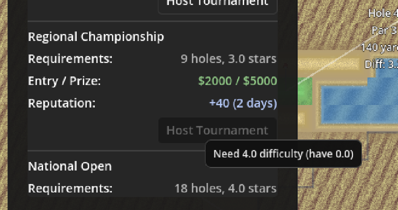
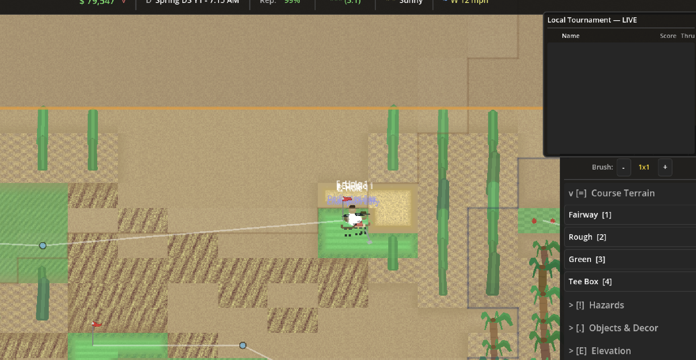
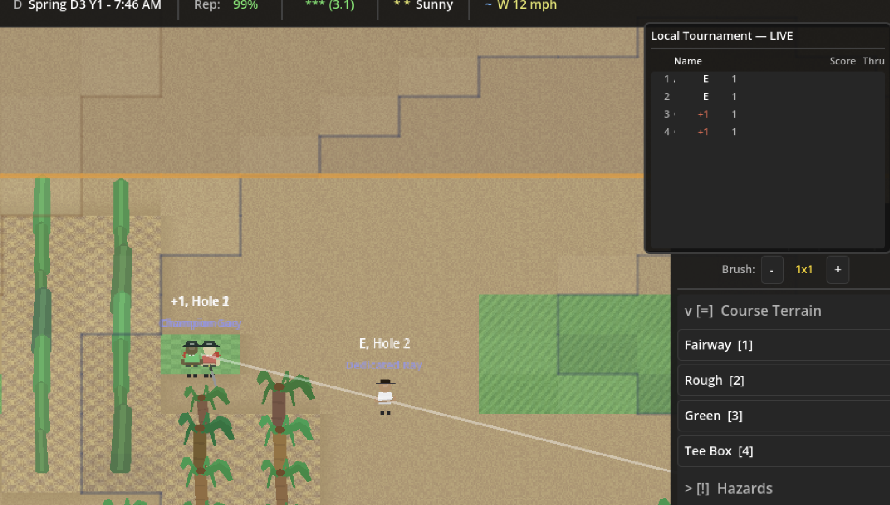
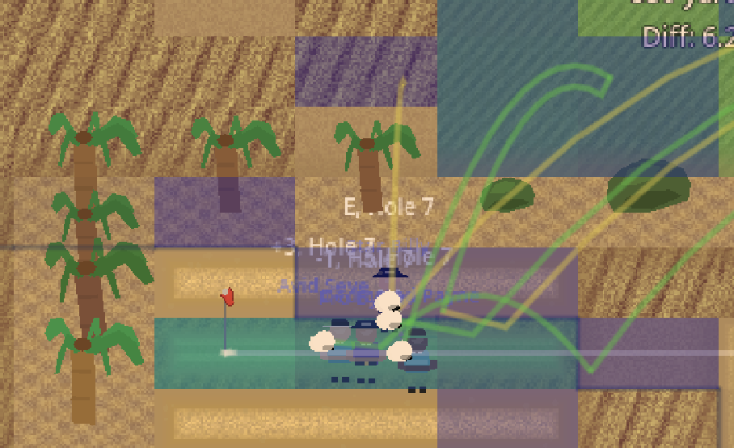
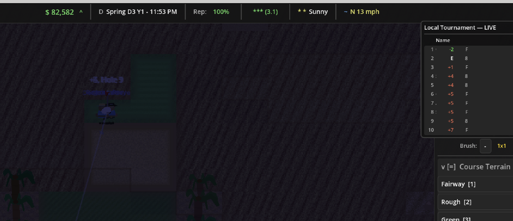
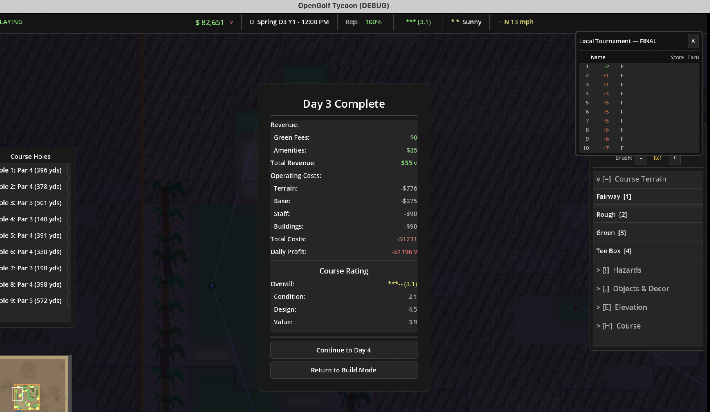
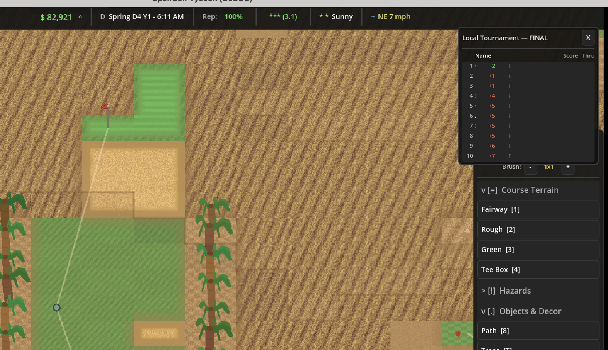

1. I should be able to drag and add trees instead of having to individually click
2. the end of day analytics average score ends up inccorect if you add holes after players finished player. It results in a much lower stated score to par. We should just take the average of golfer scores to par based on when they specifically finished their rounds. not based on the holes by the end of the day.
3. We should show the total revenue collected and maint. cost for each building when it's clicked on.
4. the text for the golfer's name is a dark grey that is difficult to read. we should make it white like their score label.
5.  I think the course difficulty check is broken for the tournament menu. I created a 9 hole course that plays like 3k+ plus yards which should have a difficulty >0
6.  The tournament leaderboard should show the total number of golfers set to play. even if they haven't teed off yet
7.  player names are not displyed on the leaderboard, only their score
8. for some reason players are hitting out of the bunker to the other fairway instead of landing it on the strip of green. . you can see those shot paths in the heatmap.
9. as a user I want to quickly check how far a distance is in yards. let's add a ctrl-click drag option that displays the yardage between my click and dragged point
10. even just a local tournament took till midnight to finish on a 9 hole course. . we probably need to speed up the golfers and also change the overall time scale to be more realistic. I think maybe just for tournament days?
11. the end of a tournament should have a pop up that shows the overall field, their score and names. Additionally it should show the feedback from the pro players and the tournament fees collected by the course.
12. the end of day report after a tournament should show the tournament fees in the daily P&L 
13.  the tournament leaderboard doesn't disappear the next day on start. it should clear once I advance to the next day.